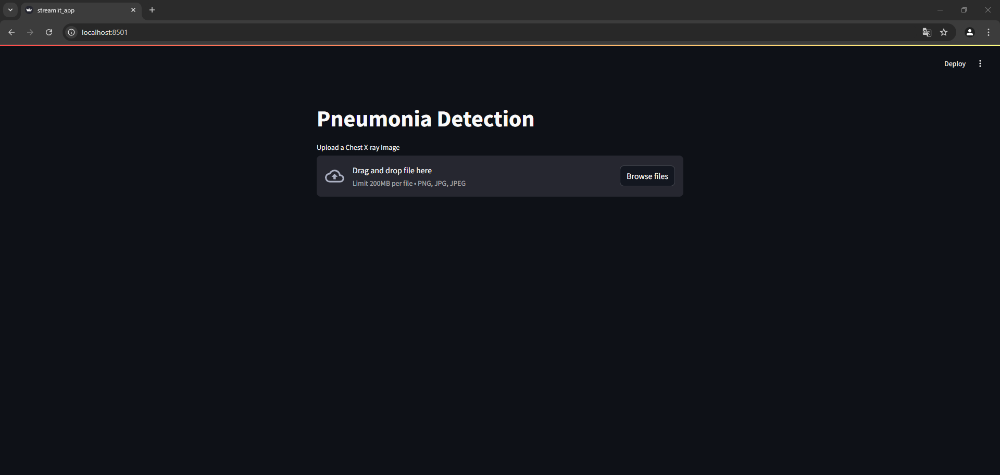
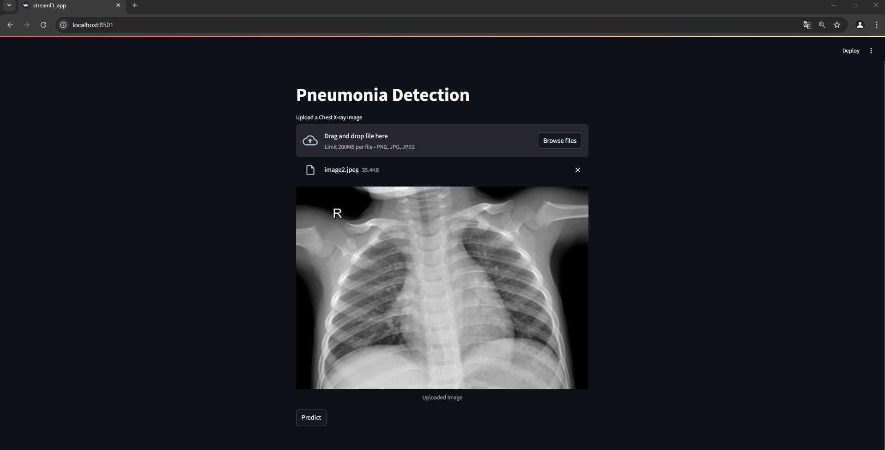
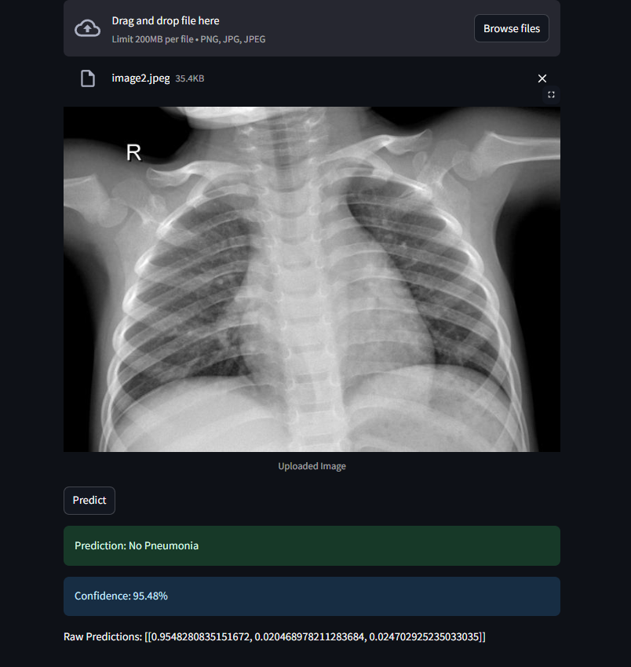

# Despliegue de modelos

## Infraestructura

- **Nombre del modelo:** (nombre que se le ha dado al modelo)
- **Plataforma de despliegue:** El endpoint esta en Railways.
- **Requisitos técnicos:** De hardware, se recomienda un minimo de 2 GB de ram y 1 vCPu core. Ademas, para otros requerimientos, es  posible  mirar las respectivas listas
- **Requisitos de seguridad:** (lista de requisitos de seguridad necesarios para el despliegue, como autenticación, encriptación de datos, etc.)
- **Diagrama de arquitectura:** (imagen que muestra la arquitectura del sistema que se utilizará para desplegar el modelo)

## Código de despliegue

- **Archivo principal:** Main.py
- **Rutas de acceso a los archivos:** Debido a la naturaleza del proyecto y del proveedor del despliegue, todos los archivos se encuentran en la misma carpeta y disponen rutas simples.
Estos archivos son:
1. dataTranformation.py
2. Dockerfile
3. Procfile
4. requirements.txt

- **Variables de entorno:** api.

## Documentación del despliegue

### **Instrucciones de instalación**  
Pasos generales:


1. **Instalar dependencias requeridas:**  
   Asegúrate de cumplir con las versiones exactas de las liberias que se encuentran en el requirements.txt,  ademas, en el entorno de desarollo se necesitaron otras dependencias explicitas en el archivo Dockerfile. 


2. **Configurar variables de entorno obligatorias:**  
   Para el correcto funcionamiento del despliegue, es necesario configurar algunas variables del entorno, estas son:
   ```bash
   export CUDA_VISIBLE_DEVICES=-1
   export TF_ENABLE_ONEDNN_OPTS=0
   ```

3. **Ejecutar el servidor:**  
   Ejecuta el servidor con `uvicorn`:  
   ```bash
   uvicorn main:app --reload
   ```  
   Aquí, `main` es el nombre del archivo que contiene el código FastAPI (sin extensión `.py`).

---

Pasos expecificos de railway:

1. **Asegurar la integridad de los archivos:** 
    Es necesario tener todos los archivos necesarios para el correcto despliegue, entre los cuales estan requirements.txt, Dockerfile y Procfile.  Cada uno da instrucciones 
    obligatorias para el correcto funcionamiento, no obstante, es bueno puntualizar que unicamente es necesario tenerlos en la carpeta raiz, no es necesario configurar ni ejecutar nada, railways se encarga de eso.
2. Esperar a que el el build y el despliegue se realicen con exito

### **Instrucciones de configuración**  

1. **Configurar recursos del modelo:**  
   - Es necesario aclarar que el modelo necesita como minimo 1 GB de ram y 1 vcpu para funcionar, no obstante, es recomendable tener una ram de 2 GB para evitar posibles problemas al momento de realizar la inferencia.

2. **Configurar rutas del modelo:**  
   - Es necesario asegurar  que la variable `MODEL_PATH` apunta a la ubicación correcta del archivo del modelo.

3. **Ajuste de preprocesamiento:**  
   - Configura las dimensiones deseadas para el redimensionamiento en `(500, 720)` según sea necesario, y de igual forma, verificar el correcto funcionamiento de las funciones de preprocesamiento en las imagenes. No obstante, el unico parametro verdaderamente "configurable" es la dimension.

4. **Puerto y host del servidor:**  
   - Es necesario configurar el puerto 8000 para el correcto funcionamiento, no obstante, en el despliegue de railways el archivo dockerfile se encarga de proporcionarlo.

---

### **Instrucciones de uso**  

1. **Subir imágenes:**  
    A traves de la interfaz grafica, se tiene la opcion de subir una imagen (sea en formato png, jpg, o jpeg) para el posterior procesamiento, tal como se puede ver a continuacion:
    
    
    Posteriormente, se da clic en predict para obtener los resultados y esperamos un par de segundos.
2. **Formato de respuesta:**  
   El servicio devolverá un JSON con:  
   - `filename`: Nombre del archivo subido.  
   - `predictions`: Array con las probabilidades de cada clase.  
   - `predicted_class`: Etiqueta de la clase con mayor probabilidad.  
   - `confidence`: Probabilidad asociada a la predicción.  
    No obstante, esta informacion es procesada por  el front dando como resultado una visualizacion mas amigable, tal que:
    

### **Instrucciones de mantenimiento**  

1. **Actualización del modelo:**  
   - Si actualizas el modelo, reemplaza el archivo `finalModel.keras` y reinicia el servidor.

2. **Revisión de dependencias:**  
   - Regularmente, ejecuta:  
     ```bash
     pip list --outdated
     ```  
     para identificar actualizaciones en las bibliotecas utilizadas.

3. **Monitoreo del servidor:**  
   - Railways permite dashboards que brindan la informacion necesaria para hacerle un seguimiento tanto a los recursos como a posibles cuellos de botella o errores que puedan surgir, por lo cual es importante mantenerse al tanto de los mismos

4. **Log de errores:**  
   - En caso de fallos, ademas, existe unos logs detallados que nos permiten trazar y entender de manera clara los problemas por los cuales la aplicacion pudo haber fallado.


