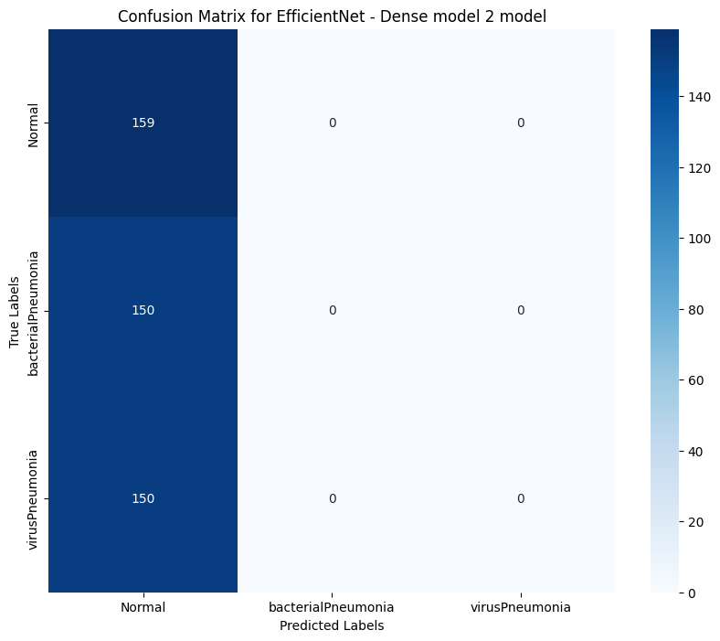
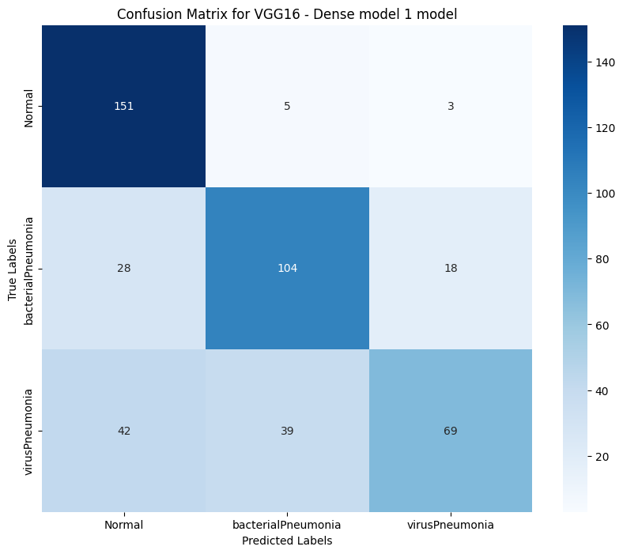
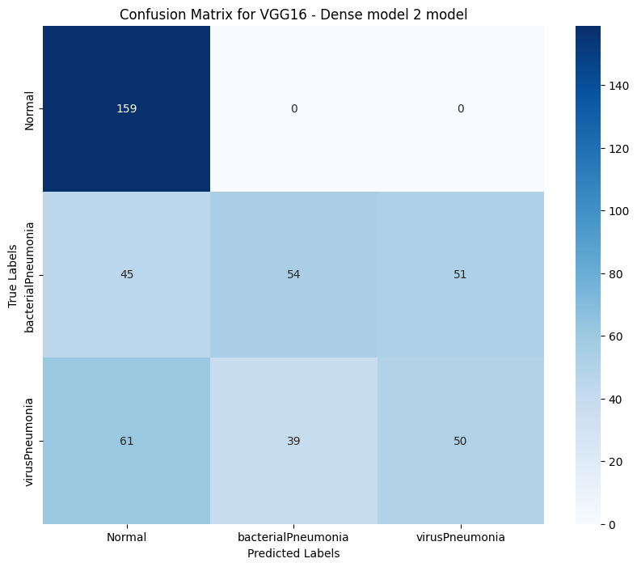
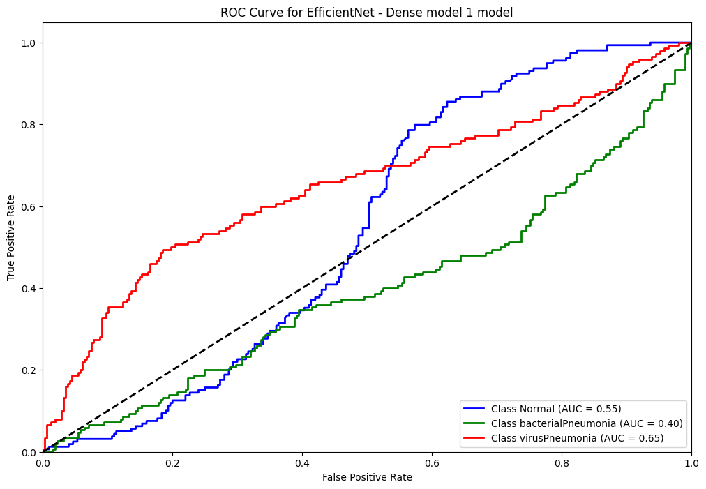
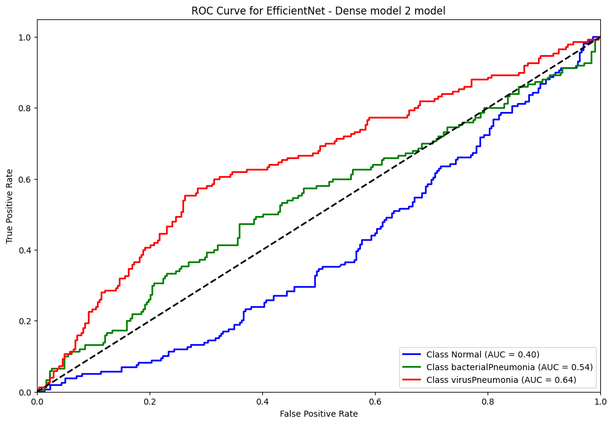
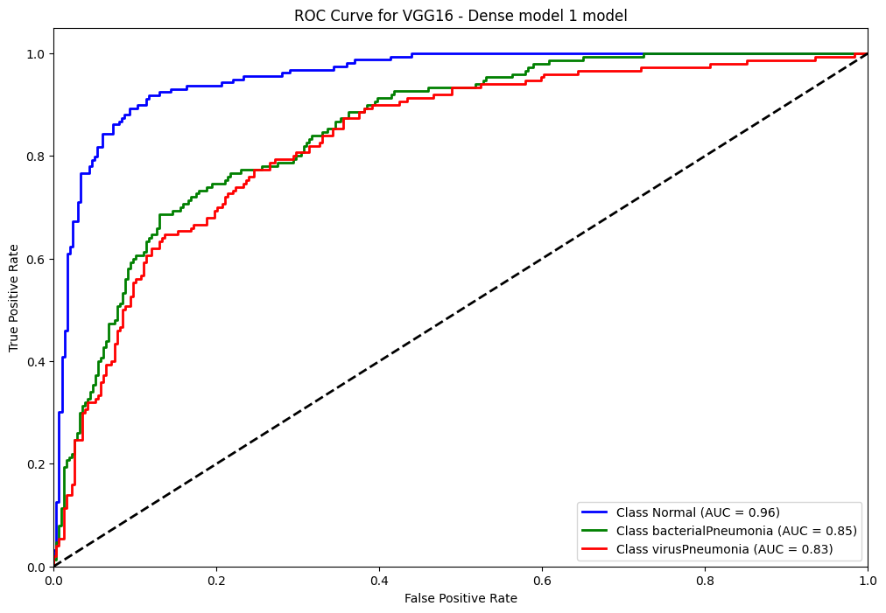
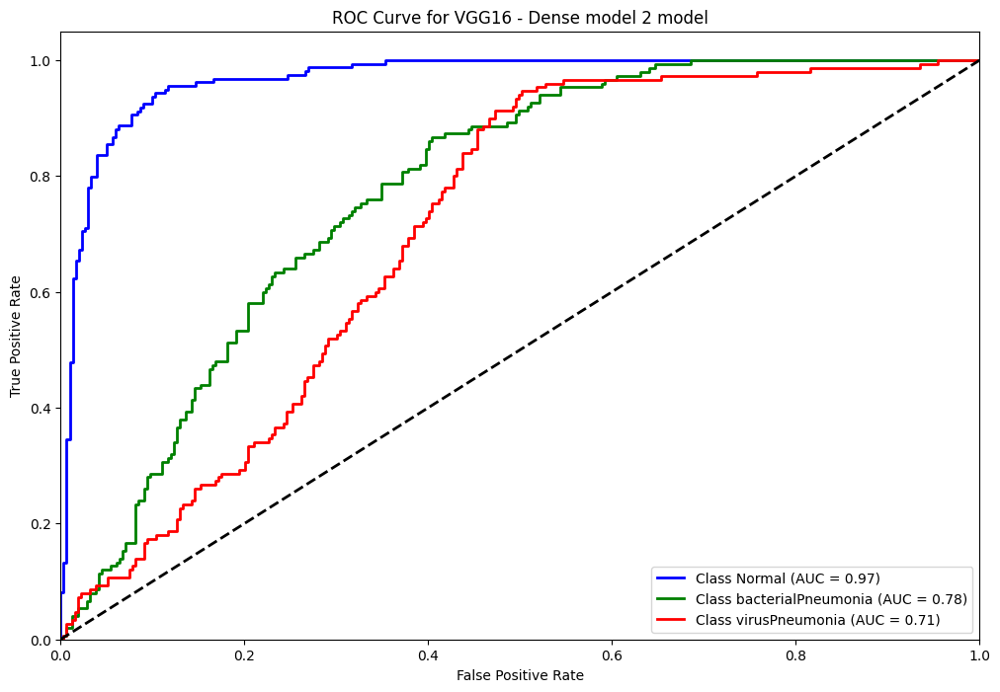

# Reporte del Modelo Baseline

## Descripción del modelo

Para abordar el problema de clasificación de imágenes en el diagnóstico de neumonía a partir de radiografías, se probaron dos modelos preentrenados, **VGG16** y **EfficientNetB0**, ambos disponibles en TensorFlow. La elección de estos modelos se basa en su reconocida eficacia para tareas de clasificación de imágenes y en su capacidad para capturar patrones visuales relevantes en las radiografías.

Además, se evaluaron dos configuraciones diferentes de capas densas para cada modelo:

1. Un modelo con dos capas densas al final de la arquitectura base.
2. Un modelo con tres capas densas al final de la arquitectura base.

Se utilizó **Keras Tuner** para realizar una búsqueda de hiperparámetros en los cuatro modelos generados por estas combinaciones, ajustando los parámetros clave como el tamaño de las capas densas, el learning rate y el tipo de optimizador.

## Variables de entrada

Las imágenes fueron procesadas en un formato de 500x500 píxeles, generando una matriz de entrada de dimensiones **500x500** con uno o tres canales (dependiendo de si las imágenes son en escala de grises o en color). Las imágenes fueron escaladas a valores entre 0 y 1 para facilitar el entrenamiento.

## Variable objetivo

La variable objetivo es la condición del paciente, una variable categórica con tres posibles valores:
- **NORMAL**
- **VIRUS**
- **BACTERIA**

## Evaluación del modelo

### Métricas de evaluación

Las métricas principales utilizadas para evaluar el rendimiento de los modelos fueron:
1. Precisión
2. Recall
3. F1-score
4. AUC-ROC

Se utilizaron tanto la matriz de confusión como la curva ROC para visualizar el rendimiento de cada configuración.

### Resultados de evaluación

A continuación, se presentan los resultados obtenidos:

#### Métricas generales:

##### Modelo con EfficientNetB0 y dos capas densas

| Clase | Precisión | Recall | F1-score |
|-------|-----------|--------|----------|
| Normal | 0.35  |    1.00    |  0.51 |
|Neumonía Bacteriana  |     0.00   |   0.00  |    0.00|
|Neumonía Viral      | 0.00  |    0.00  |    0.00|

##### Modelo con EfficientNetB0 y tres capas densas

| Clase | Precisión | Recall | F1-score |
|-------|-----------|--------|----------|
| Normal | 0.35  |    1.00    |  0.51 |
|Neumonía Bacteriana  |     0.00   |   0.00  |    0.00|
|Neumonía Viral      | 0.00  |    0.00  |    0.00|

##### Modelo con VGG16 y dos capas densas

| Clase | Precisión | Recall | F1-score |
|-------|-----------|--------|----------|
| Normal | 0.60  |   1.00   |   0.75    |
|Neumonía Bacteriana  |     0.58 |     0.36  |    0.44   |
|Neumonía Viral      | 0.50 |     0.33  |    0.40    |

##### Modelo con VGG16 y tres capas densas

| Clase | Precisión | Recall | F1-score |
|-------|-----------|--------|----------|
| Normal | 0.68    |  0.95  |    0.79|
|Neumonía Bacteriana  |     0.70   |   0.69  |    0.70|
|Neumonía Viral      | 0.77  |    0.46  |    0.57|

#### Matriz de confusión:

##### Modelo con EfficientNetB0 y dos capas densas

##### Modelo con EfficientNetB0 y tres capas densas

##### Modelo con VGG16 y dos capas densas

##### Modelo con VGG16 y tres capas densas

#### Curva ROC:

##### Modelo con EfficientNetB0 y dos capas densas

##### Modelo con EfficientNetB0 y tres capas densas

##### Modelo con VGG16 y dos capas densas

##### Modelo con VGG16 y tres capas densas

## Análisis de los resultados

De los cuatro modelos evaluados, el modelo **VGG16** con dos capas densas se destacó por ofrecer un equilibrio razonable entre las métricas de precisión, recall y F1-score. Aunque el modelo con tres capas densas también mostró buenos resultados, su rendimiento adicional no justifica la mayor complejidad en términos de tiempo de entrenamiento y riesgo de sobreajuste.

En contraste, ambos modelos basados en **EfficientNetB0** no lograron un rendimiento aceptable. En particular, los resultados muestran que clasificaron todas las imágenes como pertenecientes a la categoría "Normal", lo que resulta en métricas de precisión y F1-score extremadamente bajas para las categorías de neumonía.

Los resultados también subrayan la importancia del balance de clases y de una adecuada selección de hiperparámetros. Es posible que futuras iteraciones puedan mejorar estos modelos, pero con la configuración actual, **VGG16 con dos capas densas** es la opción más viable.

## Conclusiones

Con base en los resultados obtenidos, se concluye que:

1. El modelo **VGG16** con dos capas densas ofrece el mejor rendimiento general en términos de precisión, recall y F1-score.
2. Los modelos basados en **EfficientNetB0** no son adecuados para esta tarea en su configuración actual.
3. La elección de **VGG16 con dos capas densas** permite un equilibrio entre simplicidad y efectividad, siendo una opción adecuada para seguir explorando mejoras en el entrenamiento y ajuste de hiperparámetros.

Por lo tanto, se decide continuar trabajando con el modelo **VGG16 con dos capas densas** para el desarrollo de iteraciones futuras y para su eventual validación en un conjunto de pruebas más amplio.