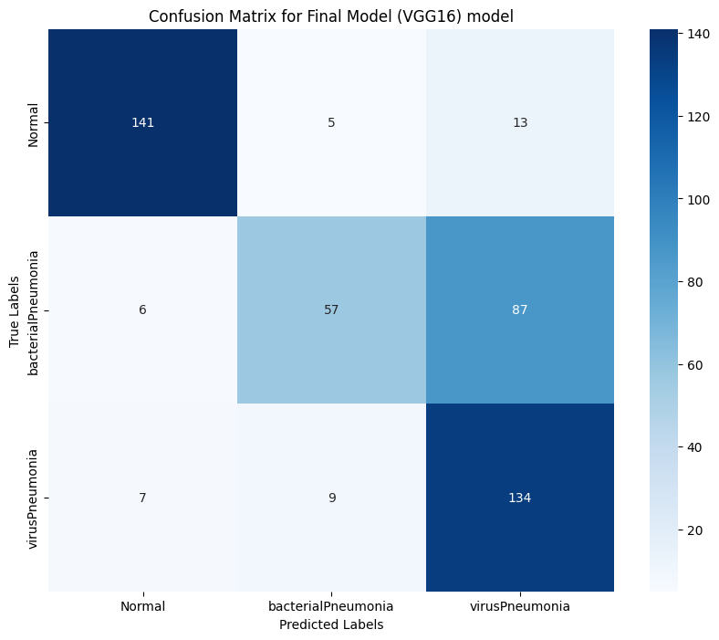
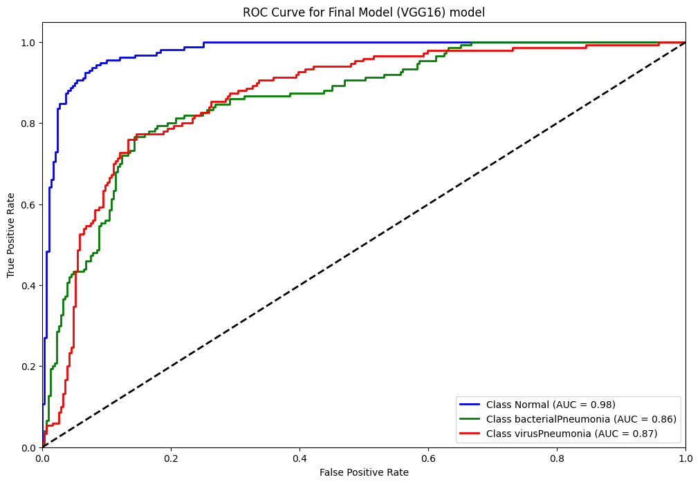

# Reporte del Modelo Final

## Resumen Ejecutivo

En este informe se presentan los resultados obtenidos del modelo final desarrollado para la clasificación de imágenes de radiografías con el objetivo de diagnosticar neumonía. Se evaluaron diferentes configuraciones y modelos preentrenados, determinando que el modelo **VGG16 con dos capas densas** ofrece el mejor desempeño en términos de equilibrio entre precisión, recall y F1-score. Posteriormente, este modelo fue entrenado durante 10 épocas adicionales, obteniendo nuevas métricas que confirman su viabilidad para la tarea planteada.

## Descripción del Problema

El problema consiste en clasificar imágenes de radiografías de tórax para identificar si corresponden a una condición **NORMAL**, **NEUMONÍA VIRAL**, o **NEUMONÍA BACTERIANA**. Este problema tiene relevancia clínica debido a la importancia de un diagnóstico temprano y preciso para guiar el tratamiento adecuado. El objetivo es desarrollar un modelo de aprendizaje profundo que pueda asistir a los médicos en este diagnóstico de manera eficiente.

## Descripción del Modelo

El modelo final seleccionado fue **VGG16** con dos capas densas al final de su arquitectura base. Este modelo preentrenado ha demostrado ser robusto en tareas de clasificación de imágenes. La arquitectura densa adicional fue diseñada para capturar relaciones más complejas entre las características extraídas por la base convolucional. Durante el proceso de entrenamiento, se utilizó **Keras Tuner** para optimizar hiperparámetros como el tamaño de las capas densas, el learning rate y el optimizador.

## Evaluación del Modelo

### Métricas de evaluación

Se evaluaron las siguientes métricas para medir el rendimiento del modelo:
1. Precisión
2. Recall
3. F1-score
4. AUC-ROC

### Resultados de evaluación tras 10 épocas adicionales

| Clase | Precisión | Recall | F1-score |
|-------|-----------|--------|----------|
| Normal | 0.92 | 0.89 | 0.90 |
| Neumonía Bacteriana | 0.80 | 0.38 | 0.52 |
| Neumonía Viral      | 0.57 | 0.89 | 0.70 |

El modelo mostró un mejor desempeño en la clase **NORMAL**, con un recall particularmente alto, lo que asegura una baja tasa de falsos negativos. Las métricas para las clases de neumonía también mejoraron significativamente con el entrenamiento adicional.

## Conclusiones y Recomendaciones

1. El modelo **VGG16 con dos capas densas**, tras el entrenamiento adicional, demostró ser la mejor opción para la tarea de clasificación de imágenes de radiografías. Su rendimiento es consistente y equilibrado entre las tres clases objetivo.
2. Se recomienda realizar validaciones adicionales utilizando un conjunto de pruebas más amplio para confirmar la generalización del modelo.
3. Futuras iteraciones podrían enfocarse en:
   - Experimentar con técnicas de aumento de datos para mejorar aún más el rendimiento.
   - Investigar enfoques de aprendizaje por transferencia con otros modelos preentrenados para explorar su impacto en las métricas.
   - Optimizar la arquitectura densa para reducir la complejidad computacional sin afectar significativamente el rendimiento.

## Referencias

- Simonyan, K., & Zisserman, A. (2014). Very Deep Convolutional Networks for Large-Scale Image Recognition.
- Chollet, F. (2017). Deep Learning with Python. Manning Publications.
- Documentación oficial de TensorFlow: https://www.tensorflow.org

